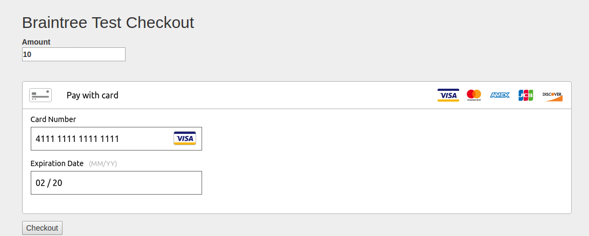

# Braintree Flask Example

An example Braintree integration for python in the Flask framework.

## Setup

1. Configure
Add your Braintree private key, public key and merchant ID in `.env` file.

2. Install
  ```sh
  $ pip install -r requirements.txt
  ```

3. Start Server
  ```sh
  $ export FLASK_APP=run.py
  $ flask run
  ```

## Demo


